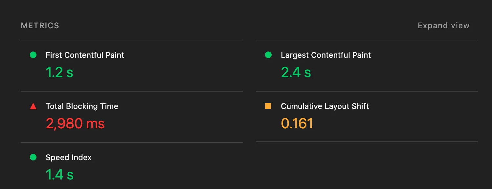
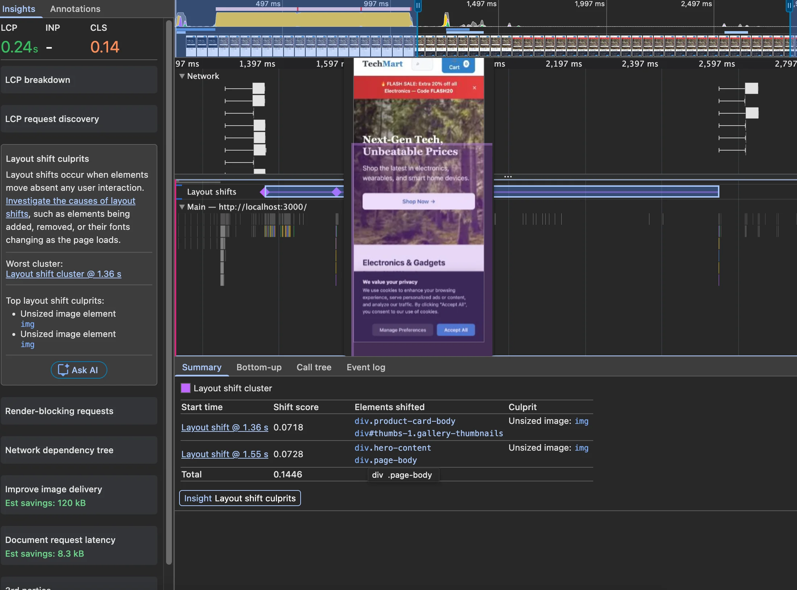
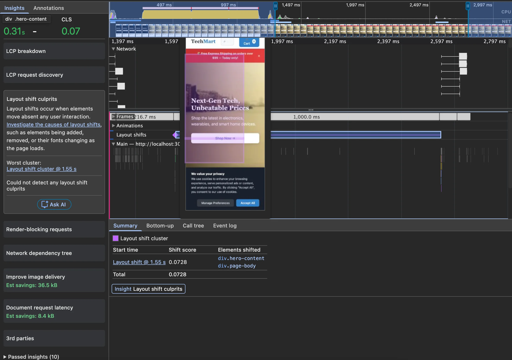
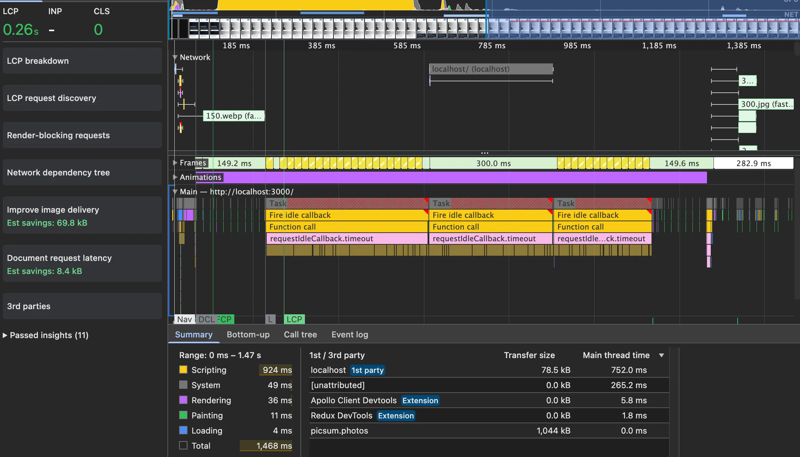

CLS looked simple to me at first. Then I spent time actually fixing it and understood it is trickier than it appears. The score is hard to reproduce reliably in lab data, because CLS accumulates over the entire time a user spends on the page — not just during load. Even field data can vary a lot between sessions.

That said, lab data is still a good starting point. It gives you enough signal to find real problems.

I am using the same [demo e-commerce site](https://github.com/mykytashabandev/slow-e-commerce-page) from the previous article. The `improved/cls` branch has all the fixes from this article applied.

One area I am skipping here: CLS in SPA routing. When a JavaScript framework navigates between pages, the browser never reloads the HTML — from the browser's perspective it is one continuous session. That makes CLS measurement and fixing quite different. Topic for a separate article.

## Why CLS Happens

According to [web.dev](https://web.dev/articles/optimize-cls#common-causes-of-cls), the four most common causes are:

**Images without dimensions.** The browser needs the image's aspect ratio to reserve the right amount of space before the image loads. If you only set `width` and `height` in CSS, the browser does not know the ratio while parsing the HTML — the element has no intrinsic size yet. Set `width` and `height` directly on the `` tag and the browser will calculate the ratio and pre-allocate the space.

**Ads, embeds, and other late-loaded content.** Same idea — reserve the space before the content arrives.

**Animations.** The rule you will hear in every CSS animation tutorial: use `transform` instead of properties that trigger layout (like `top`, `left`, `height`). This applies to CLS too. Animations using `transform` and `opacity` run on the compositor thread and do not trigger layout, so they do not cause layout shifts at all. The [Layout Instability API](https://github.com/WICG/layout-instability) is what the browser uses to detect and score the shifts that do happen.

**Fonts.** When a custom font loads after the page has already rendered, the fallback font gets swapped out and text reflows. Two strategies to avoid this:

- `font-display: optional` — the browser uses the custom font only if it is ready before the first render. If not, it uses the fallback for the entire session, and caches the real font for next time. No shift on this load, and the font is available immediately on the next visit.
- Adjust the fallback font to match. Use a tool like [screenspan.net/fallback](https://screenspan.net/fallback) to find a close system font, then tune it with `size-adjust`, `ascent-override`, `descent-override`, and `line-gap-override` so the swap causes no visible reflow.

One more thing worth knowing: layout shifts caused by **user interaction** (clicks, taps, key presses) within a 500ms window are excluded from the CLS score. Scrolling and hovering do not count as interactions — shifts triggered by those are still reported.

## The Setup

After fixing LCP in the [previous article](/blog/lcp-optimization), I ran Lighthouse again on the same demo. CLS came in at **0.161** — over Google's 'good' threshold of 0.1, but not yet in the 'poor' range. Real e-commerce sites often live here, which makes it a useful starting point.



## Diagnosing with the Performance Tab

Open **Chrome DevTools → Performance tab**, record a reload in incognito, then look at the left sidebar for **Layout shift culprits**. Click a purple bar in the timeline — DevTools will animate the elements that moved. It makes the problem immediately obvious.



The first thing DevTools flagged: *"Unsized image"*.

## Fix 1: Product Images

The product card images had no dimensions:

```html

```

Adding `width` and `height` gives the browser the aspect ratio it needs to reserve space:

```html

```

This one change brought CLS down to **0.07**.

## Fix 2: Hero Image

DevTools also flagged the hero image as *"Unsized image"*. The fix is the same — add `width` and `height` matching the image's intrinsic size:

```html

```

One thing to check when using `srcset`: all variants should share the same aspect ratio. If they do not, the space reserved by `width`/`height` will not match the loaded image.

In this case all three variants are roughly 8:3, so it is fine. But if your mobile and desktop images show **different crops** — say a square close-up on mobile and a wide landscape on desktop — a single `width`/`height` on `` cannot cover both. Use `<picture>` with dimensions on each `<source>`:

```html
<picture>
  <source
    media="(max-width: 799px)"
    srcset="hero-mobile.jpg"
    width="400"
    height="400"
  >
  <source
    media="(min-width: 800px)"
    srcset="hero-desktop.jpg"
    width="1400"
    height="520"
  >
  
</picture>
```

`width` and `height` on `<source>` are supported in Chrome 90+, Firefox 89+, and Safari 15+.



The *"Unsized image"* warning is gone. But there is still a shift — this time from the promo banner.

## Fix 3: Promo Banner

The banner was dynamically injected above the hero image after a delay:

```js
function promoBannerInit() {
  setTimeout(function () {
    const banner = document.createElement('div');
    banner.className = 'promo-banner';
    // ...
    hero.parentNode.insertBefore(banner, hero);
  }, 1500);
}
```

Inserting an element above existing content pushes everything down — a textbook layout shift. DevTools did not name it directly, but the animation made it obvious.

The fix: add a placeholder element in the HTML that reserves the space from the start. When the banner loads, it fills the existing slot instead of pushing things around.

HTML:
```html
<div class="promo-banner-slot"></div>
```

CSS:
```css
.promo-banner-slot {
  min-height: 46px;
}
```

Updated JS — swap the slot into a banner instead of inserting a new element:
```js
function promoBannerInit() {
  setTimeout(function () {
    const slot = document.querySelector('.promo-banner-slot');
    if (!slot) return;

    slot.className = 'promo-banner';
    slot.setAttribute('role', 'alert');
    slot.style.minHeight = '';
    const text = promos[Math.floor(Math.random() * promos.length)];
    slot.innerHTML = `
      <span>${text}</span>
      <button class="banner-close" aria-label="Close promotion banner">
        ×
      </button>
    `;

    slot.querySelector('.banner-close').addEventListener('click', () => {
      slot.innerHTML = '';
      slot.className = '';
    });
  }, 1500);
}
```

When the user closes the banner, the reserved space collapses — that is technically a layout shift. But because it happens within 500ms of a user click, it is excluded from the CLS score.

## Result

After all three fixes, CLS dropped to **0**.



---

CLS is mostly about one thing: reserving space so the UI does not surprise the user. A senior developer I know thought CLS was mainly a performance concern because layout recalculations are expensive. That is true, but it is not the main reason to care about it. A page with bad CLS can still feel fast. The real problem is user experience — elements moving unexpectedly cause misclicks, and misclicks make people leave.

CLS is a [user-centric metric](https://web.dev/articles/user-centric-performance-metrics), same as LCP and INP. The score exists because the experience is bad, not because the browser is working harder.

Next I am going to look at INP.
