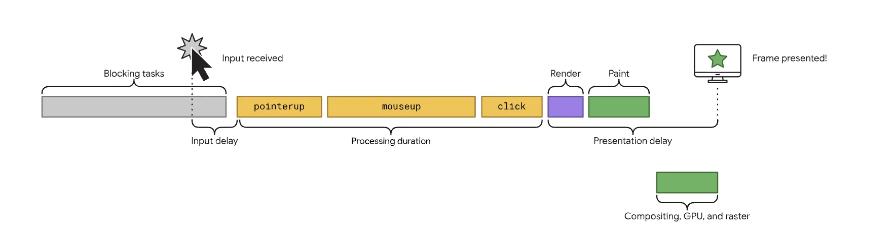
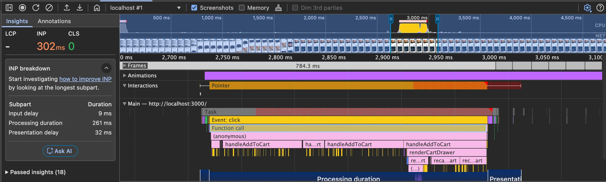
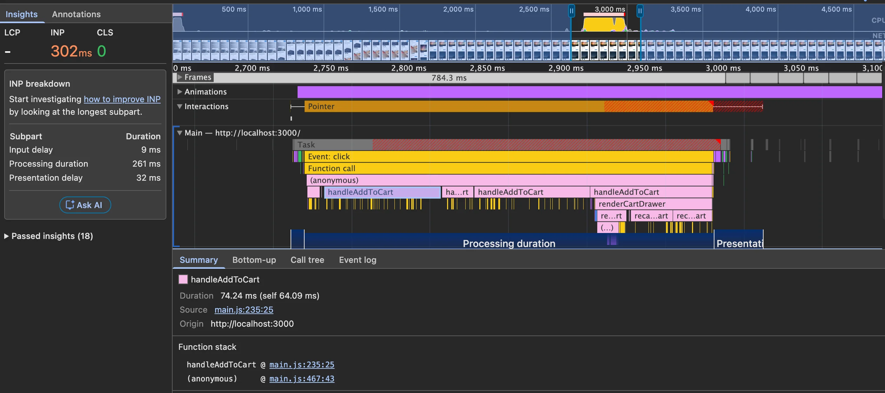
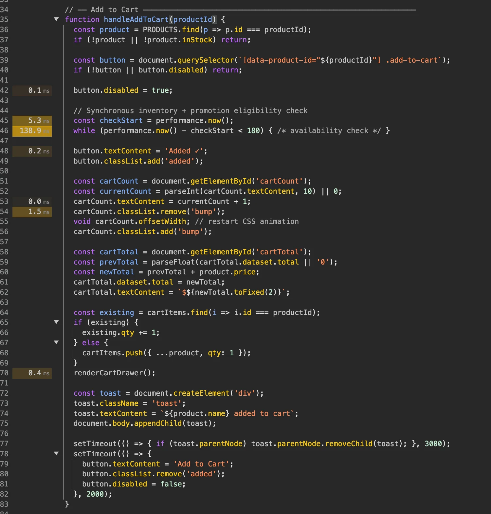
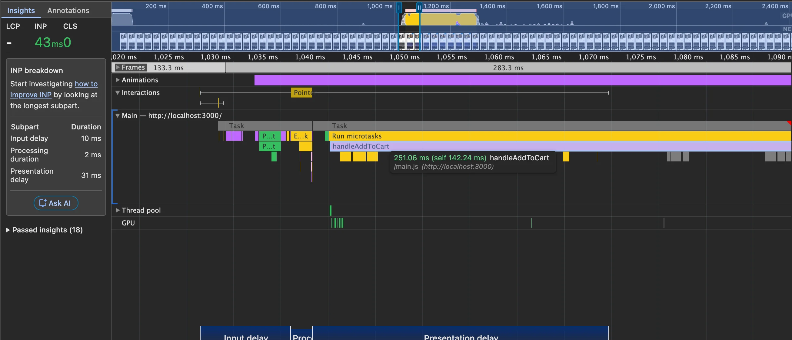
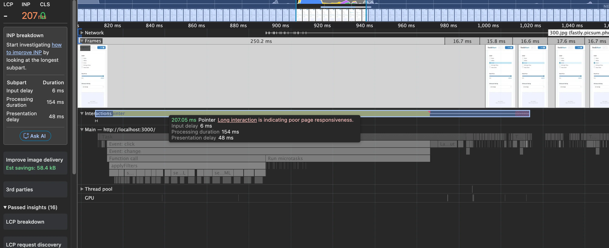
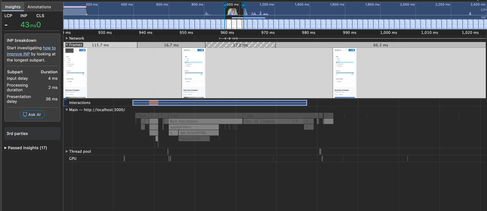

INP is the last of the three Core Web Vitals — and the trickiest to work with. Like CLS, it is recorded across the entire page session, not just during load. But unlike CLS, it depends on what the user actually does. If it is a simple landing page you probably will not have problems. For a page with many interactions measured on a variety of low-end mobile devices, it can be a real challenge.

I am using the same [demo e-commerce site](https://github.com/mykytashabandev/slow-e-commerce-page) from the previous articles. The `improved/inp` branch has all the fixes applied.

## What INP Measures

INP measures how quickly the page responds to user interactions. A score below **200 ms** is considered good.

Only these interactions are counted:

- Clicking with a mouse
- Tapping on a touchscreen
- Pressing a key on a physical or on-screen keyboard

Scrolling and hovering are not included.

The final INP score is the worst interaction in the session. One exception: for pages with more than 50 interactions, the single worst one is ignored — roughly the 98th percentile.

## The Three Phases

Every interaction has three phases. This diagram from web.dev shows how they connect:



**Input delay** is the wait before the browser can even start handling your interaction. It happens when the main thread is busy with something else — a previous task that has not finished yet.

**Processing duration** is the time spent running all the event handlers attached to the interaction. A click event, for example, fires `pointerdown`, `mousedown`, `pointerup`, `mouseup`, and `click` in sequence. Long synchronous work in any of these callbacks blocks the main thread and makes the interaction feel slow.

**Presentation delay** is what happens after the handlers finish — the browser recalculates styles, does layout, and paints. Anything that forces a layout recalculation (changing geometry-affecting CSS properties, or mixing layout reads and writes in a loop) adds time here. The rule: measure first, then mutate.

## Diagnosing with the Performance Tab

Lighthouse does not help with INP — there is no way to simulate unpredictable user interactions in a lab. Instead, use **Chrome DevTools → Performance tab**.

Since I am on an M2 MacBook, I use **6× CPU throttling** to simulate a mid-range mobile device. Record the session, perform the interaction, stop recording, then click the INP breakdown — it shows all three phases mapped to the timeline.

## Fix 1: Add to Cart

I started with the "Add to cart" button — the most important interaction on any e-commerce page.

After recording and clicking a product, the performance tab showed processing duration as the bottleneck:



The call tree pointed directly to `handleAddToCart`:



Clicking the source link opened the exact lines responsible, with timing:



A loop with **138.9 ms** — in the demo it imitates an inventory availability check, but in a real app it could be any expensive synchronous operation.

The key question: does this check need to finish before the user sees feedback? No. The button can visually respond ("Added ✓") immediately, and the inventory check can run after.

The fix is to yield to the browser before the heavy work, so it gets a chance to paint the visual update first. The modern way is [`scheduler.yield()`](https://developer.mozilla.org/en-US/docs/Web/API/Scheduler/yield):

```js
// before
function handleAddToCart(product) {
  updateCartUI(product);
  runInventoryCheck(product); // 138ms loop
}

// after
async function handleAddToCart(product) {
  updateCartUI(product);
  await scheduler.yield(); // browser paints here
  runInventoryCheck(product);
}
```

`scheduler.yield()` is not yet supported in Safari. A safe fallback:

```js
const yieldToMain = () =>
  'scheduler' in globalThis && scheduler.yield
    ? scheduler.yield()
    : new Promise((resolve) => setTimeout(resolve, 0));

async function handleAddToCart(product) {
  updateCartUI(product);
  await yieldToMain();
  runInventoryCheck(product);
}
```

`setTimeout(0)` schedules a macrotask, so the browser _may_ render between the two tasks — but it is not guaranteed if the task queue is busy. `scheduler.yield()` explicitly yields to the rendering pipeline, which is why it was introduced.

INP dropped to **43 ms**:



One thing worth noting: `handleAddToCart` still runs a 251 ms task after the yield. This does not affect the perceived responsiveness of _this_ click, but it does block the main thread. If the user clicks something else during those 251 ms, that next interaction will have a large input delay. Ideally you would also break the heavy loop into smaller chunks or make the inventory check genuinely async. For now 43 ms is acceptable.

## Fix 2: Filter Products

The second interaction I tested was applying a product filter. On mobile the sidebar is hidden — to test it I removed `display: none`:

```css
.sidebar {
  position: static;
}
```

Recording a filter click showed INP at **207 ms**, again with processing duration as the bottleneck:



The call stack led to `applyFilters`, which contained this loop:

```js
// before
grid.innerHTML = '';

const slice = filteredProducts.slice(0, 24);
for (let i = 0; i < slice.length; i++) {
  grid.innerHTML += createProductCardHTML(slice[i]);
}
```

Each `+=` does three things: serializes the current DOM subtree to a string, concatenates the new markup, then re-parses the entire accumulated string from scratch. By the 24th card, every iteration re-parses ~15 KB of HTML that was already parsed before. This is O(n²) behaviour — and that re-parsing is what consumed the 154 ms of processing duration.

The fix — write to the DOM exactly once:

```js
// after
grid.innerHTML = filteredProducts
  .slice(0, 24)
  .map(createProductCardHTML)
  .join('');
```

The same `scheduler.yield()` technique also applies here — yield before the DOM write so the checkbox updates visually before the grid re-renders:

```js
async function applyFilters() {
  updateCheckboxUI();
  await yieldToMain();
  grid.innerHTML = filteredProducts
    .slice(0, 24)
    .map(createProductCardHTML)
    .join('');
}
```

Processing duration dropped to **2 ms** — the INP for the filter interaction is now well inside the green range:



---

INP is never fully solved — user interactions are unpredictable and devices vary enormously. Two rules that cover most cases:

For **processing duration**: if the longest operation in your handler does not need to finish before the user sees feedback, defer it. Show the optimistic state first, do the work second.

For **presentation delay**: check for layout thrashing. If you are mixing layout reads and writes, the browser cannot batch the work. [This list](https://gist.github.com/paulirish/5d52fb081b3570c81e3a) covers everything that forces layout.

INP is not a one-time fix. It needs attention whenever new interactions are added to a page.
