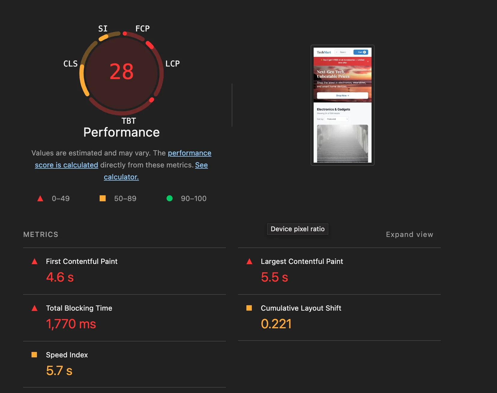
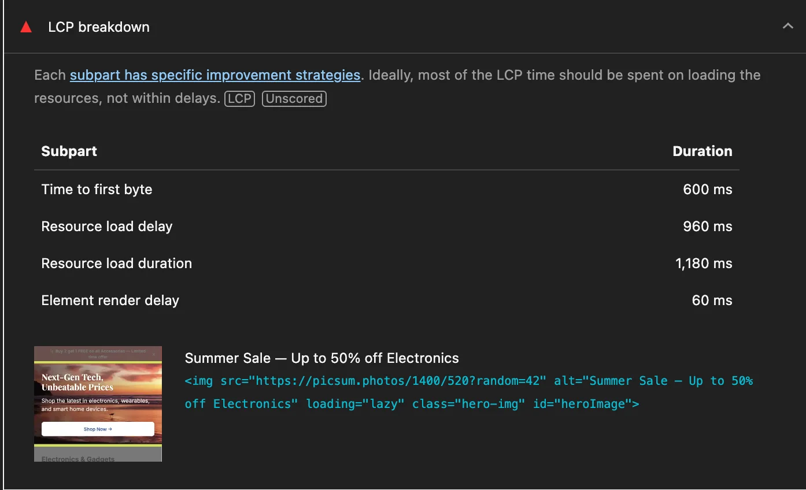
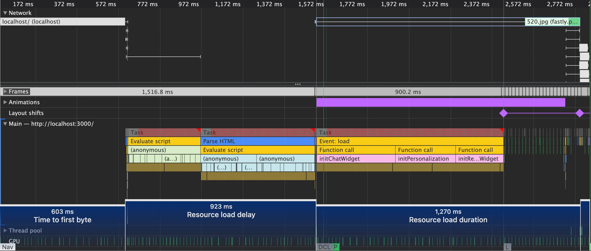
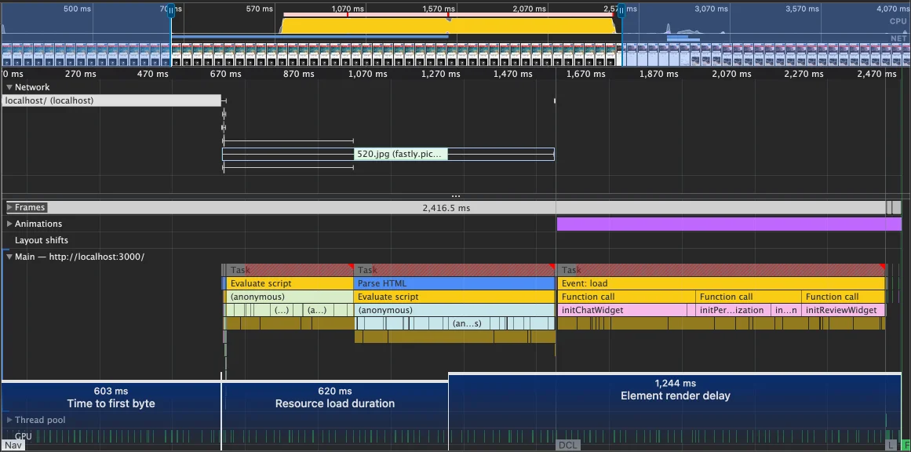
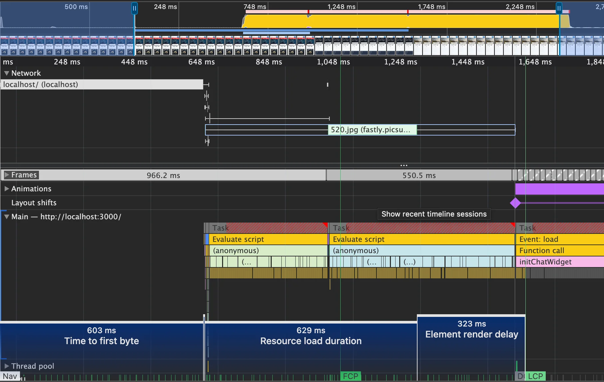
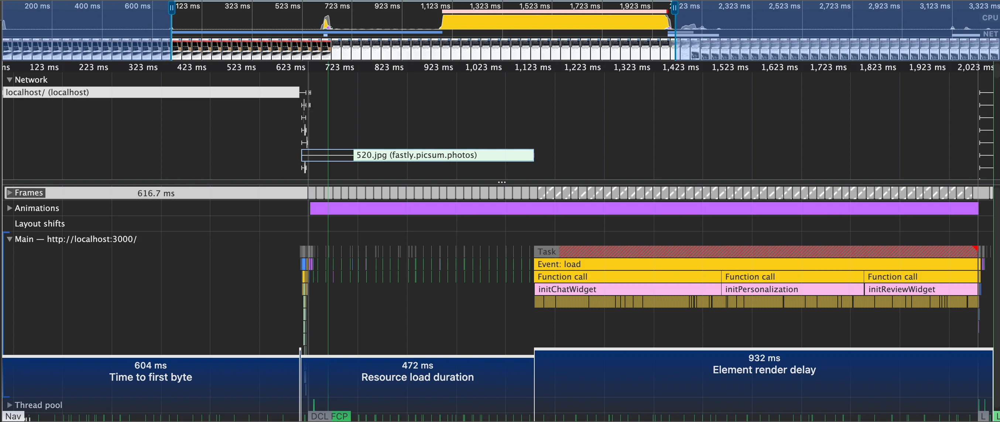
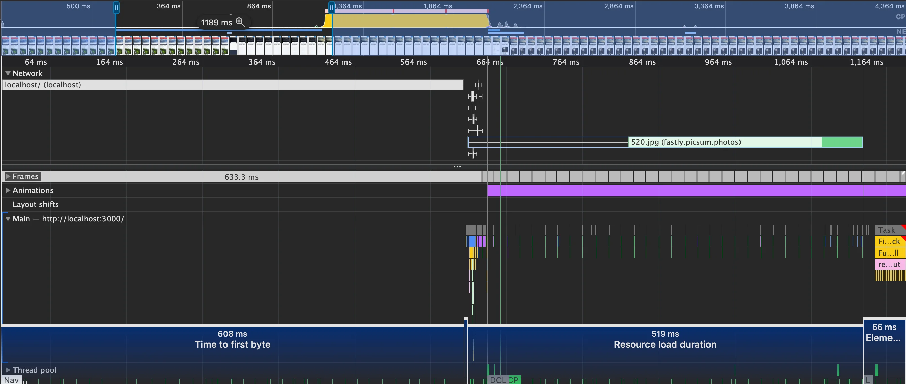
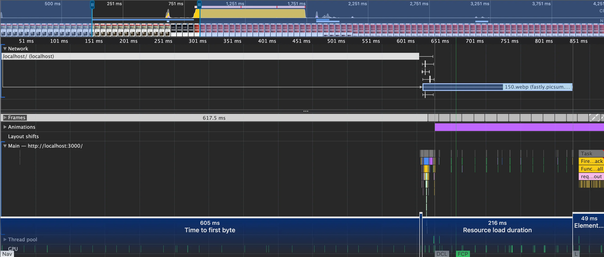
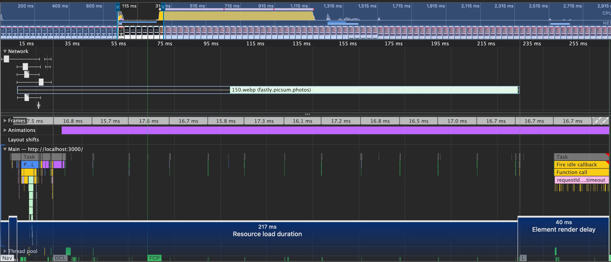
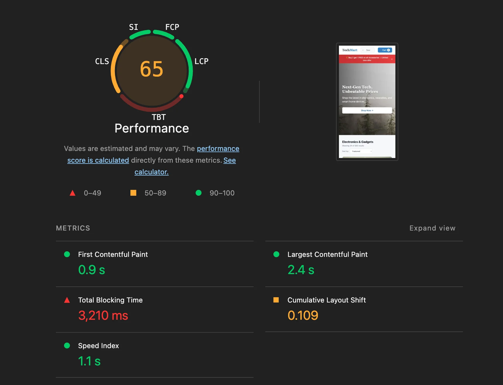

Reading about performance is easy. Actually doing it is different — you learn things when you hit problems and have to solve them.

I built a [demo e-commerce site](https://github.com/mykytashabandev/slow-e-commerce-page) with intentionally bad web vitals. The repo has two branches: `main` with all the problems, and `improved/lcp` with the fixes. This article walks through everything I changed to go from a Lighthouse score of 28 to green.

## The Setup

The demo is an imitation of a real e-commerce page. E-commerce was a good choice because loading time directly affects revenue — slow pages lose sales.

All measurements are done in Lighthouse on mobile, in incognito mode. Incognito removes browser extension noise. Mobile is what Google cares most about. Lab data only — in real projects you need field data too, but lab data is enough to understand the core ideas.

Starting score: **28**.



## LCP Subparts

According to [web.dev](https://web.dev/articles/lcp), LCP is made of four parts:

- **Time to First Byte (TTFB)** — time until the browser receives the first byte of HTML.
- **Resource load delay** — time between TTFB and when the browser starts fetching the LCP resource.
- **Resource load duration** — how long the LCP resource takes to download.
- **Element render delay** — time between the LCP resource finishing and the element actually painting.

Lighthouse shows all four in the LCP breakdown:



The [web.dev guide](https://web.dev/articles/optimize-lcp) recommends fixing them in this order:

> Eliminate resource load delay → Eliminate element render delay → Reduce resource load duration → Reduce TTFB

## Fix 1: Eliminate Resource Load Delay

Lighthouse alone does not tell you much about what is happening before LCP. Open **Chrome DevTools → Performance tab**, hit record, then reload the page. Click the LCP marker at the bottom — it highlights the LCP element on the timeline and shows what ran before it.



The hero image in the HTML looked like this:

```html

```

`loading="lazy"` tells the browser: _"do not fetch this until the element is near the viewport."_ The hero image IS the viewport — it is the first thing visible. Lazy loading delays the request while the browser waits for layout to confirm the element is in view.

This looks like an optimization but it is the opposite. Remove `loading="lazy"` and add `fetchpriority="high"`, which tells the browser to start fetching this image as a high-priority request:

```html

```

Resource load delay dropped to **4 ms**.



Note: Lighthouse's `fetchpriority` detection requires a direct image URL. If your CDN uses redirects, the audit may not recognize the attribute even if it is correctly set in the HTML.

## Fix 2: Eliminate Element Render Delay

After fixing resource load delay, a new problem appeared: element render delay jumped to **1244 ms**. The image was fully loaded in memory but could not paint because scripts were blocking the main thread.

The culprits were `analytics.js` and `vendor.js`, both loaded with plain `<script>` tags that block HTML parsing.

- `analytics.js` does not need to wait for the DOM to be parsed. Use [`async`](https://developer.mozilla.org/en-US/docs/Web/API/HTMLScriptElement/async): it downloads in parallel and runs as soon as it is ready.
- `vendor.js` needs the DOM to be ready. Use [`defer`](https://developer.mozilla.org/en-US/docs/Web/API/HTMLScriptElement/defer): it downloads in parallel but runs only after parsing is complete.

This reduced element render delay significantly. But the scripts themselves contained heavy loops that kept the main thread busy after they ran.



For a demo, I removed those loops. In a real app you would minimize synchronous work in scripts, or move expensive operations off the main thread.



Removing the loops uncovered something: `initChatWidget`, `initPersonalization`, and `initReviewWidget` started executing and blocking the thread. They were previously invisible because `analytics.js` and `vendor.js` ran first and masked them. Now they were exposed.

None of these widgets are needed at page load. Wrap them in [`requestIdleCallback`](https://developer.mozilla.org/en-US/docs/Web/API/Window/requestIdleCallback) with a timeout fallback so they run when the browser is idle but will still execute eventually:

```js
requestIdleCallback(
  () => {
    initChatWidget();
    initPersonalization();
    initReviewWidget();
  },
  { timeout: 3000 },
);
```

Note: `requestIdleCallback` support in older Safari versions (before 16.4) is missing. Add a `setTimeout` fallback if you need to support them:

```js
const rIC = window.requestIdleCallback ?? ((cb) => setTimeout(cb, 1));
rIC(
  () => {
    /* init widgets */
  },
  { timeout: 3000 },
);
```



Here is how element render delay changed at each step:

| State               | What changed         | Element render delay |
| ------------------- | -------------------- | -------------------- |
| Baseline            | —                    | ~671 ms              |
| async / defer       | scripts non-blocking | ~323 ms              |
| Remove busy loops   | scripts lightweight  | **~932 ms ↑**        |
| requestIdleCallback | widget init deferred | ~49 ms               |

The regression at step 3 is expected — once the heavy loops were removed, the previously masked widgets became the new bottleneck. Step 4 fixed both.

## Fix 3: Reduce Resource Load Duration

Now the focus is on the image itself: size and source.

Two easy wins:

- **Format** — WebP or AVIF compresses better than JPEG or PNG with no visible quality loss.
- **`srcset`** — serve smaller images to smaller screens instead of always downloading the full-size version.

Updated image tag:

```html

```

A CDN also helps here. WebP reduces file size, `srcset` ensures smaller screens download a smaller image, but a CDN reduces transfer time by serving the file from a location closer to the user.



Resource load duration is now **216 ms**. A CDN would bring this down further.

## Fix 4: Reduce Time to First Byte

TTFB is mostly a server and infrastructure concern, not something you can fix purely on the frontend. In the demo I removed an artificial delay from `server.js`. In a real project you would look at server response time, caching headers, and CDN placement.



## Result

After all four fixes, LCP reached **0.29 s** — well into the green range.



There is still room to improve with a proper CDN, but the goal here was to understand the process, not to hit the absolute minimum.

---

Performance optimization is more dynamic than it looks. Even when you follow a clear priority order, each fix reveals something new. One thing worth remembering: the LCP element on desktop and mobile can be different. If you optimize for desktop without checking mobile, you might improve one and silently break the other.

Next I am going to look at CLS.
